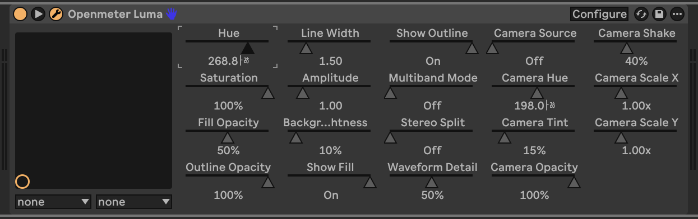
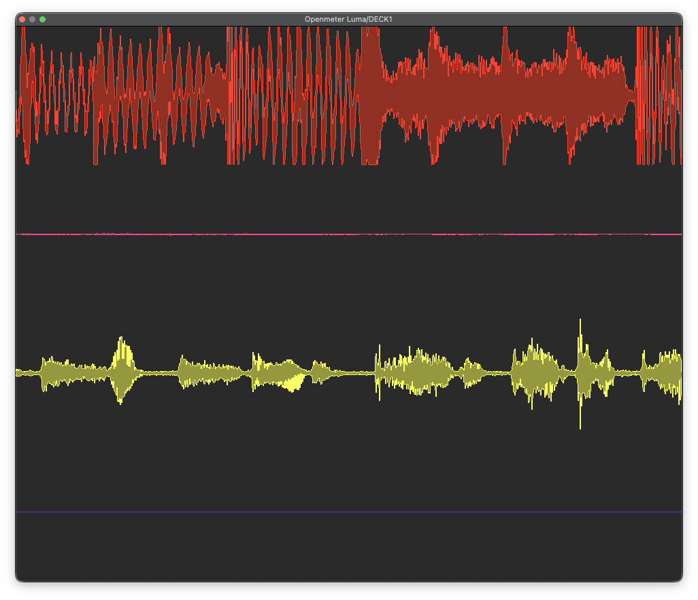

# LUMA

Real-time waveform visuals for Ableton on macOS.

`macOS only` `Ableton Live 11/12` `VST3 beta`

[Download latest beta](https://github.com/OpenMeterStudio/LUMA/releases/latest) | [Preview](#preview) | [Install](#install) | [Feedback](#feedback) | [Privacy and terms](#privacy-and-beta-terms)

## Preview

| Control UI | Multi-instance view |
| --- | --- |
|  |  |

## What You Get

- VST3 plugin for Ableton Live on macOS.
- Real-time waveform visualization on any track or the master.
- Optional camera backgrounds, color controls, and MIDI sync.
- Standalone app is planned later and is not part of the current beta.

## Install

1. Download the latest release.
2. Copy `OpenmeterLuma.vst3` to `~/Library/Audio/Plug-Ins/VST3/`.
3. Quit and reopen Ableton Live to force a rescan.
4. Open Ableton -> `Plug-ins` -> `VST3` -> `OpenmeterLuma`.
5. Drop it on a track or the master and allow microphone permission when prompted.

If Ableton does not see it, confirm the file exists at `~/Library/Audio/Plug-Ins/VST3/OpenmeterLuma.vst3` and fully restart Ableton.

## How To Use And What To Test

- Enable monitoring or play back audio so the plugin has signal.
- Use the plugin UI to adjust colors, camera mode, and MIDI sync.
- Leave the UI open while testing so hotkeys and overlays respond.
- Confirm the plugin appears reliably after install and rescan.
- Run it for 30-60 minutes and watch for stutter, crashes, or UI freezes.
- Test one instance per track if you want stacked multi-channel visuals.
- Check camera permission prompts and camera stability if you use that mode.

## Hotkeys

| Key | Action |
| --- | --- |
| `5` | Open image overlay picker |
| `0` | Clear image overlay |
| `9` | Toggle telemetry overlay |
| Click `<Openmeter/>` | Show or hide logo |

Hotkeys work when the LUMA plugin UI has focus in Ableton.

## Multiple Instances

- The first LUMA instance opened in a project becomes the master renderer.
- Additional instances stay small but still feed their track audio into the master view.
- To change which instance is the master, remove all LUMA instances and load the desired track first.
- If the view disappears, close and reopen the first-loaded instance.

## Feedback

Open an issue here: [GitHub issues](https://github.com/OpenMeterStudio/LUMA/issues/new)

Include:

- macOS version
- Mac type: Apple Silicon or Intel
- Ableton version: 11 or 12
- Steps to reproduce
- Expected result
- Actual result
- Crash message, screenshot, or `OpenmeterLuma.log` if available

## Privacy And Beta Terms

- We collect the contact info and beta feedback you send us.
- We use it for beta access, updates, and troubleshooting.
- We do not sell personal information.
- LUMA is beta software, so features may change and crashes are possible.
- Microphone permission is required for audio input. Camera permission is optional.

This README is the GitHub-safe version of the beta portal, so the privacy and beta terms summary lives here instead of on a separate site.
